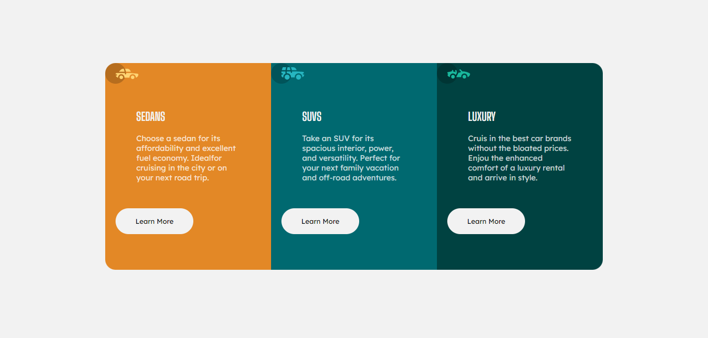

# Frontend Mentor - 3 column preview card component

This is a solution to the [3 column preview card component challenge on Frontend Mentor](https://www.frontendmentor.io/challenges/3column-preview-card-component-pH92eAR2-). Frontend Mentor challenges help you improve your coding skills by building realistic projects. 

## Table of contents

- [Overview](#overview)
  - [Screenshot](#screenshot)
  - [Links](#links)
- [My process](#my-process)
  - [Built with](#built-with)
  - [What I learned](#what-i-learned)
  - [Useful resources](#useful-resources)
- [Author](#author)


## Overview

### Screenshot




### Links

- Repository URL: <https://github.com/danielashjari/3-column-preview-card-component>
- Live Site URL: <https://danielashjari.github.io/3-column-preview-card-component/>

## My process

### Built with

- HTML5 
- SCSS


### What I learned

In this challenge I mostly worked on my SCSS, how to use @forward and @use instead of @import.
For example:

```scss
    @use "./mixins";
    @use "./basic" as *;
    body {
    background-color: $bg;
    .main-box {
        .sedans {
            background-color: $bg-sedans;
            button {
                @include mixins.button($bg-sedans);
            }
        }


```


### Useful resources

- [Codercoder](https://www.youtube.com/c/TheCoderCoder) - This helped me for compiling SCSS in a new way and how to use @forward and @use.


## Author

- Frontend Mentor - [@danielashjari](https://www.frontendmentor.io/profile/danielashjari)


